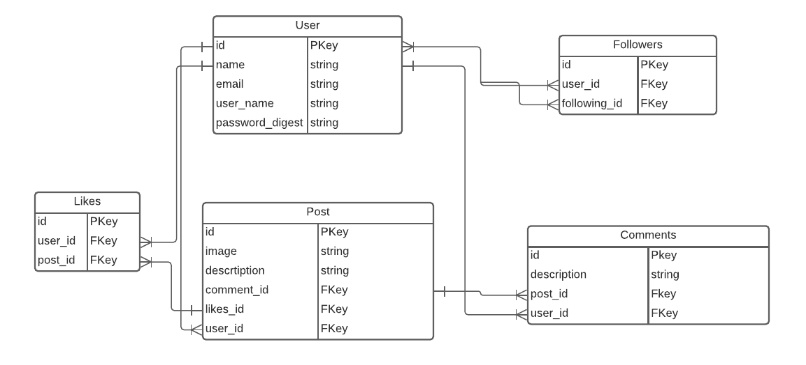
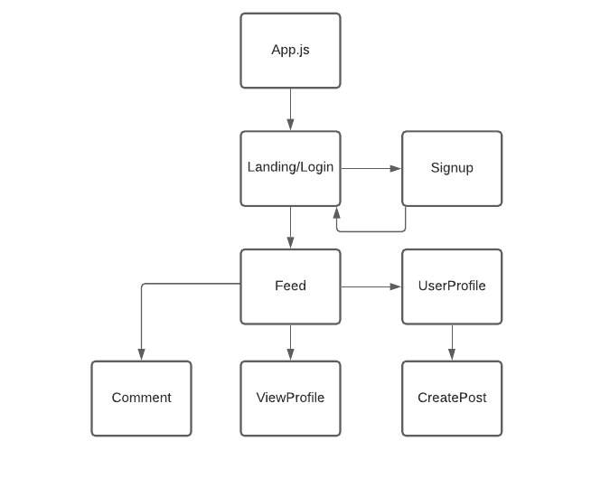

# petsagram

#### Group: David Martel, Tyler Klafke, Jady Hom

***

### Description
Petstagram is an online photo-sharing app that allows you to share your favorite photos of your pets to your followers. Petstagram will allow you to follow any of the users on our application by simply searching for their usernames. You'll be able to like and comment on anyone's post right on the picture of the pet.

***

### Technologies Used
* HTML / CSS / Javascript
* Postresql
* Express
* React
* Node

***

### Getting Started

Get started by signing up! 

[Our Trello Board](https://trello.com/b/QHiIwRJ9/petstagram) - where we kept track of the process of creating this fullstack application.

***

### User Stories
* Users will be able to see the login page.
* New users will be able to click a link that will navigate them to the sign up page.
* Once user signs up, they will login to their account.
* Users will be able to see a feed page.
* Users will be able to view their profile and other user profiles.
* Users will have followers.
* Users will be able to create posts.
* Users will be able to like and comment on posts.

***

### ERD - Entity Relationship Diagram

***

### Component Hierarchy Diagram

***

### Wireframe
Initial Mockup/Wireframe

***

### Screenshots
Final Mockup/Wireframe

***

### Future Updates

- [ ] future updates
- [ ] future updates
- [ ] future updates
- [ ] future updates

***

### Credits
[LucidChart](https://www.lucidchart.com/)

[Trello Board](trello.com)

[Cloudinary](https://cloudinary.com/)

[Heroku](https://www.heroku.com/)