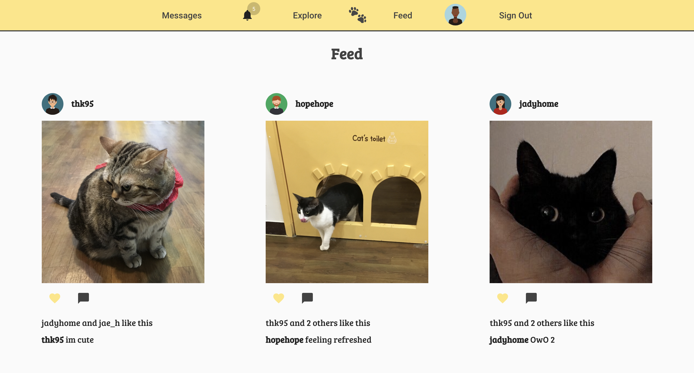
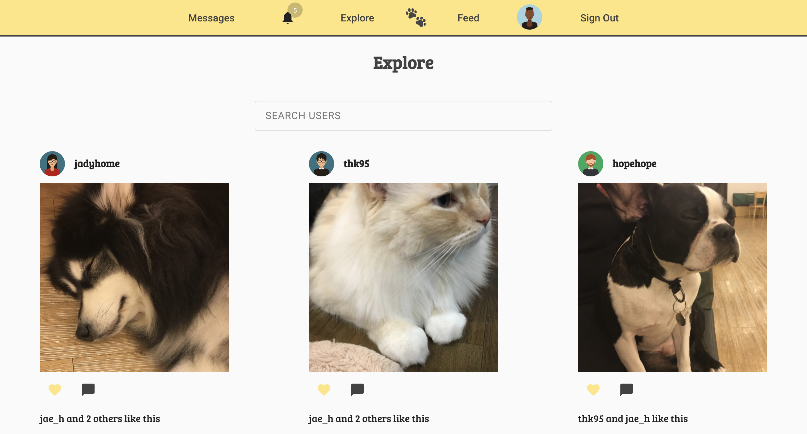
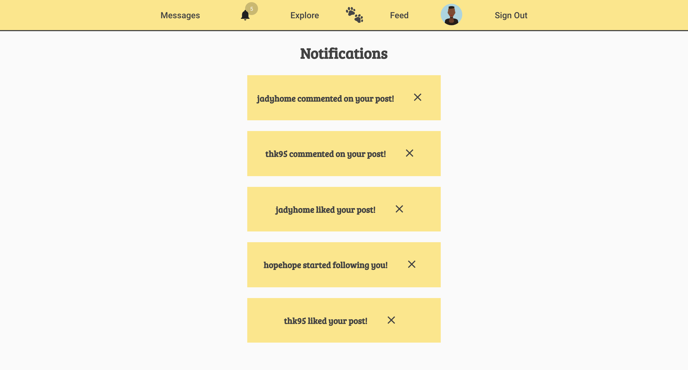

# petsagram 🐾

---

### Group

David Martel [Github](https://github.com/davey4) | [LinkedIn](https://www.linkedin.com/in/david-martel-8117981b9/)

Jady Hom [Github](https://github.com/jadyhome) | [LinkedIn](www.linkedin.com/in/jadyhom)

---

### Description

Petsagram is an online photo-sharing app that allows you to share your favorite photos of your pets to your followers. Petsagram will allow you to follow any of the users on our application by simply searching for their usernames. You'll be able to like and comment on anyone's post right on the picture of the pet.

---

### Technologies Used

- HTML / CSS / Javascript
- Postresql
- Express
- React
- react-md
- Node

---

### Getting Started

Get started by signing up!
[Petsagram](https://petsagram-105.herokuapp.com/)

[Our Trello Board](https://trello.com/b/QHiIwRJ9/petstagram) - where we kept track of the process of creating this fullstack application.

---

### User Stories

- Users will be able to see the home page.
- New users will be able to click on the Sign Up button that will navigate them to the sign up page.
- Once user signs up, they will be able to login to their account.
- Users will be able to view the feed page with posts of their followings.
- Users will be able to view the explore page with all posts from all users.
- Users will be able to view their profile and other user profiles.
- Users will be able to follow other users.
- Users will be able to create posts.
- Users will be able to like and comment on posts.
- Users will be able to see notifications.

---

### ERD - Entity Relationship Diagram

---

### Component Hierarchy Diagram

---

### Wireframe

Initial Mockup/Wireframe

---

### Screenshots

Final Mockup/Wireframe

Home Page

Sign Up Page

Choose Avatars

Sign In Page

User's Feed Page

Explore Page

View User Profile

Current User's Profile Page

Upload Post

Notifications

---

### Future Updates

- [ ] Direct Messaging

---

### Credits

[LucidChart](https://www.lucidchart.com/)

[Trello Board](trello.com)

[Cloudinary](https://cloudinary.com/)

[react-md@v2](https://react-md.dev/)

[Heroku](https://www.heroku.com/)
